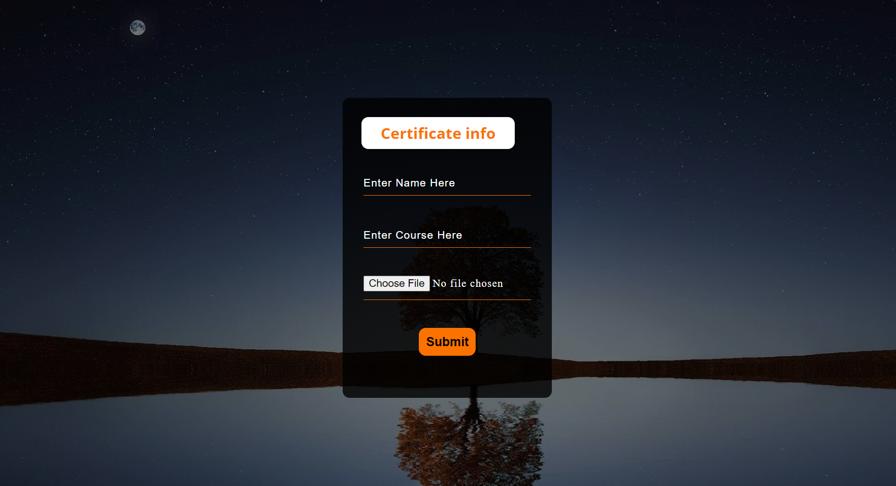
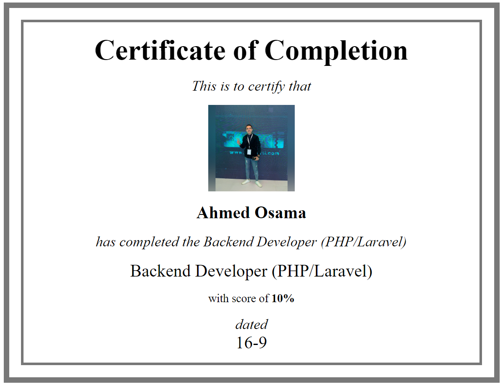

# Certificate Project

This Project designed to generate User Certificate

* [Certificate Form](#certificate-form)
* [Certificate Page](#certificate-page)
* [Database](#database)

## Certificate Form

That is the Page for get the certificate data (name, course, and image)

  

## Certificate Page

That is the Page for showing the certificate 

  

## Database
Database name is: <code>certificate_project</code>
 
 
<code>
<strong>CREATE TABLE</strong> `certificates` 
( 
    `id`   int primary key not null auto_increment, 
    `path` varchar(200)    not null, 
    `name` varchar(100)    not null, 
    `img`  varchar(200)    not null 
) ENGINE=InnoDB DEFAULT CHARSET=utf8mb4 COLLATE=utf8mb4_general_ci;
</code>